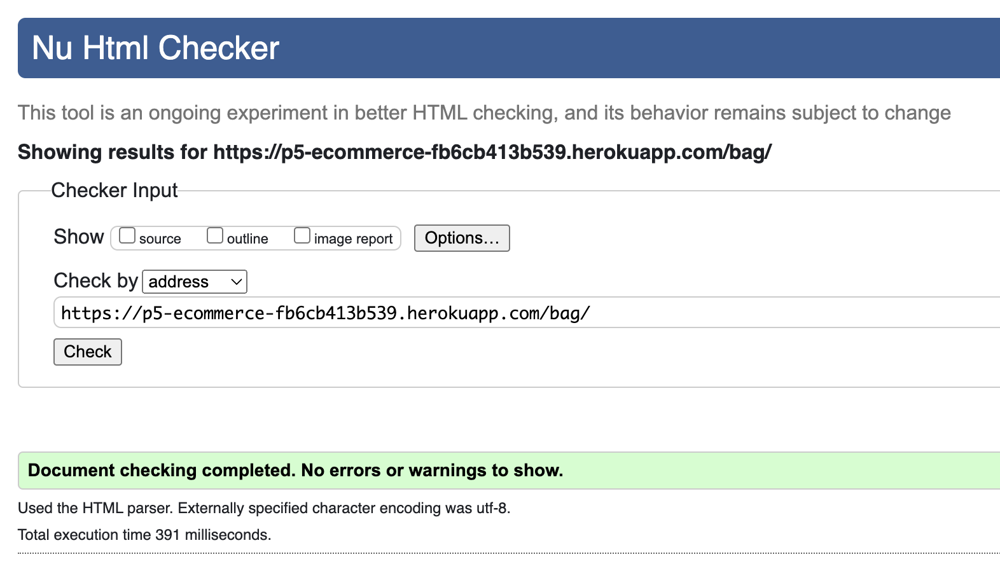
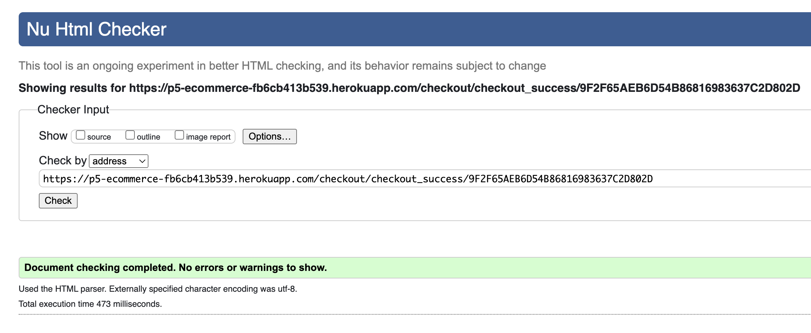
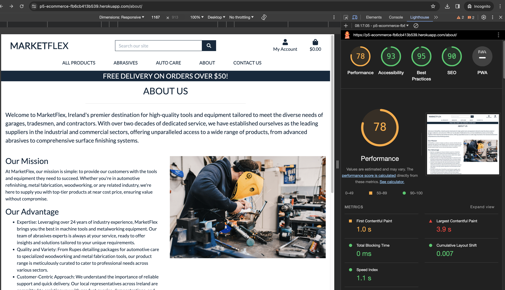

# Testing

Return back to the [README.md](README.md) file.

During the development of the project flake8 was used to correct any syntax errors and to ensure that the code was PEP8 compliant. The code was also tested using the CI pylint https://pep8ci.herokuapp.com/ and the results were satisfactory. The are some exceptions to the PEP8 compliance, such as line length, which were necessary for the code to function as intended.

Google chrome developer tools were used to test the responsiveness of the site on different devices. The site was also tested on different browsers such as Firefox, Safari and Microsoft Edge to ensure that the site was fully functional on all browsers.

The site was also tested on different devices such as mobile, tablet and desktop to ensure that the site was fully responsive.

## Code Validation

### CSS

I have used the recommended [CSS W3C Validator](https://jigsaw.w3.org/css-validator/) to validate all of my CSS files.

- base.css  ✅
- checkout.css  ✅
- profile.css  ✅

### HTML

I have used the recommended [HTML W3C Validator](https://validator.w3.org) to validate all of my HTML files.

| Page | Screenshot | Notes |
| --- | --- | --- |
| Home |  | Pass: No Errors |
| About |  | Pass: No Errors |
| Products |  | Pass: No Errors |
| Product Details |  | Pass: No Errors |
| Bag |  | Pass: No Errors |
| Contact |  | Pass: No Errors |
| Checkout |  | Pass: No Errors |
| Checkout Success |  | Pass: No Errors |
| Newsletter |  | Pass: No Errors |

### CI Python Linter

- I ran the CI Python Linter and the results were satisfactory. I'm only displaying the main views.py file results due to time contraints. But every .py file was linted using flake8 extension in VSCode and the results were satisfactory. The is the exception of the settings.py file which had a few errors that were necessary for the code to function as intended.

| App | Screenshot | Notes |
| --- | --- | --- |
| bag |  | Pass: No Errors |
| checkout |  | Pass: No Errors |
| contact |  | Pass: No Errors |
| home |  | Pass: No Errors |
| newsletter |  | Pass: No Errors |
| product |  | Pass: No Errors |
| profile |  | Pass: No Errors |
| review |  | Pass: No Errors |

## Manual Testing

I have conducted a series of manual tests on my application.

| Page | User Action | Expected Result | Pass/Fail | Comments |
| --- | --- | --- | --- | --- |
| Nav links | | | | |
| | Click on Logo text | Redirected to Home page | Pass | |
| | Click on All Products link in navbar | Redirected to All Products page | Pass | |
| | Click on Auto Care link in navbar | Dropdown appears of autocare filters | Pass | |
| | Click on Auto Care dropdown link in navbar | Redirected to All Products page with selected filter items | Pass | |
| | Click on Contact Us link in navbar | Redirected to Contact page | Pass | |
| | Click on Special Offers link in navbar | Dropdown appears of product view filters | Pass | |
| | Click on Special Offers dropdown link in navbar | Redirected to All Products page with selected filter items | Pass | |
| | Enter product name into Search box | Products results searched and matching items returned on all products page | Pass | |
| | Click on Register link in navbar | Redirected to Register page | Pass | |
| | Click on Login link in navbar | Redirected to Login page | Pass | |
| | Click on Bag link in navbar | Redirected to Bag page | Pass | |
| | Click on My Account - My Profile link in navbar | Redirected to User Profile page | Pass | |
| | Click on My Account - Logout link in navbar | Redirected to Logout page | Pass | |
| | Click on Product Management link in navbar | Redirected to Add Product page | Pass | |
| Footer | | | | |
| | Click on Subscribe to news letter link | Redirected to Subscribe to our Newsletter page | Pass | |
| | Click on Quick Link Home link | Redirected to Home page | Pass | |
| | Click on Quick Link Product link | Redirected to Products page | Pass | |
| | Click on Quick Link Contact link | Redirected to Contact Us page | Pass | |
| | Click on Social Media Facebook link | Redirected to the facebook page | Pass | |
| Register | | | | |
| | Enter valid email address into both email fields | Field will only accept email address format | Pass | |
| | Enter valid password into both password fields | Field will only accept password format | Pass | |
| | Click on Sign Up button | Redirects user to verify your email page when succesful | Pass |
| | Enter an existing email | Error appears with A user is already registered with this email address | Pass | |
| | Enter an existing user name | Error appears with A user with that username already exists | Pass | |
| Log In | | | | |
| | Enter valid username/email | Field validation will pass if username or email format | Pass | |
| | Enter valid password | Field validation will only accept password format | Pass | |
| | Click Login button | User logs in succefully, Redirects to home page | Pass | |
| | Enter an invalid email | Error appears with invalid email address | Pass | |
| | Enter an invalid password | Error appears with invalid password address | Pass | |
| Log Out | | | | |
| | Click Logout button | Redirects user to logout confirmation page | Pass |
| | Click Sign Out button | User is logged out succefully, Redirects user to home page | Pass |
| Profile | | | | |
| | Click on the My Profile dropdown link | Redirects user to my profile page | Pass | |
| | Click on Update Information | Saves the inputted data to user profile | Pass | |
| | Click on Order History links | Redirects to user order confirmation page | Pass | |
| Site Pages that required user to be logged in | | | | |
| | Navigate to any login required URL | Redirect to login page, redirect back after login | Pass | |
| Products | | | | |
| | Click on product image | Redirect to clicked product details page | Pass | |
| | Click on product title | Redirect to clicked product details page | Pass | |
| | Click on sorting dropdown options | Sort products by selected criteria | Pass | |
| Products - Admin Only| | | | |
| | Click on an edit button | Redirect to edit product page for that product | Pass | |
| | Click on a delete button | Trigger deletion of product | Pass | |
| Product Details | | | | |
| | Click on product image | Load image in new tab for larger viewing | Pass | |
| | Click on Keep Shopping button | Redirect to products page | Pass | |
| | Click on Add To Basket button | Adds product to basket, basket toast message displayed | Pass | |
| Product Details - Admin Only | | | | |
| | Click on an edit button | Redirect to edit product page for that product | Pass | |
| | Click on a delete button | Trigger deletion of product | Pass | |
| Contact | | | | |
| | Email input | User enters email | Pass | |
| | Email input | Required, accepts only email format | Pass | |
| | Name input | Required, user must enter a name | Pass | |
| | Message input | Required, user enters their message | Pass | |
| | Click on Send button | Posts form if valid, redirects to home page and Success toast message is displayed | Pass | |
| Add New Product - Admin Only | | | | |
| | Category Input | Required, select from options | Pass | |
| | SKU Input | Not required, value entered | Pass | |
| | Name Input | Required | Pass | |
| | Description Input | Required | Pass | |
| | Size Input | Optional | Pass | |
| | Price Input | Required, Numbers only | Pass | |
| | Rating Input | Not required, Numbers only | Pass | |
| | Image URL | Not required | Pass | |
| | Image | Not required | Pass | |
| Edit Product - Admin Only | | | | |
| | Click on Cancel button | Redirect to products page | Pass | |
| | Click on Update Product button | Save changes, redirect to product details page and displays success toast message | Pass | |
| Delete Product - Admin Only | | | | |
| | Click on Delete button | Trigger deleteion of product | Pass | |
| Basket | | | | |
| | Click on Remove link | Removes item from basket | Pass | |
| | Click on Keep Shopping button | Redirect to products page | Pass | |
| | Click on Secure Checkout button | Redirect to Checkout page | Pass | |
| Checkout | | | | |
| | Full Name Input | Required | Pass | |
| | Email Input | Required | Pass | |
| | Phone Number Input | Required | Pass | |
| | Street Address 1 Input | Required | Pass | |
| | Street Address 2 Input | Not required | Pass | |
| | Town Or City Input | Required | Pass | |
| | County Input | Not required | Pass | |
| | Postal Code Input | Not required | Pass | |
| | Country Input | Required, select from options | Pass | |
| | Stripe Card Details | Required, validates on input | Pass | |
| | Check save delivery info. box | Saves information to user profile | Pass | |
| | Click product image in order summary | Redirect to the product details page | Pass | |
| | Click on Adjust Bag button | Redirect to Basket page | Pass | |
| | Click on Complete Order button | Complete Checkout with given information, redirect to order confirmation page if valid | Pass | |
| Newsletter - Subscribe | | | | |
| | Email Input | Required, accepts only email format | Pass | |
| | Click on Subscribe button | Subscribes user, redirects to homepage, displays toast success message | Pass | |
| Product Rating | | | | |
| | Click on a rating dropdown | Allows choice of rating to be picked | Pass | |
| | Enter a comment | Not Required, user must enter a comment | Pass | |
| | Click on Submit button | Submits rating, displays success toast message | Pass | |

## Google Lighthouse

| Page | Screenshot | Notes | Solution |
| --- | --- | --- | --- |
| Home |  | Performance was impacted due to large image and render-blocking resources | This could be solve using the steps provided in this link but due to time constraints it was not. [Link](https://developer.chrome.com/docs/lighthouse/performance/render-blocking-resources/?utm_source=lighthouse&utm_medium=devtools)  |
| About |  | Performace was impacted on this page | Save about image in webp format. I had issues using the correct format so reverted to the jpg before submission. |
| Products |  | Performance was impacted on this page due to the product image format. |  Save images in next-gen formats  |
| Product Details |  |  |  |
| Product Add |  |  |  |
| Bag |  |  | |
| Contact |  |  | |
| Checkout |  |  |   |
| Order Confirmation |  |  |   |
| Profile |  |  |   |
| Newsletter |  |  |   |
| Login |  |  |   |
| Register |  |  |   |
| Logout |  |  |   |

## Automated Testing

- Due to time constraints, I was unable to write automated tests for the project. I plan to write automated tests in the future to ensure that the site is fully functional and to prevent any future bugs.

## Bugs

| Bug Title| Image| Details|
| --- | --- | --- |
| Product detail page not displaying for anonymous users.        |       | The issue was that the product detail had logic to check if the user had already submitted a review for the product. This logic was causing the product detail page to not display for anonymous users. Fixed by adding a check to see if the user is authenticated before checking if they have submitted a review. |
| Images not displaying on product details page                  |          | The issue was that `+ static(settings.MEDIA_URL, document_root=settings.MEDIA_ROOT)` was not included in the `urls.py` file. Fixed by adding the line to the `urls.py` file. |
| Checkout confirmation button redirect                          |                                                                       | The issue was that the button to redirect back to products had the URL with filters that did not exist. Fixed by removing the filters from the URL.                          |
| Confirmation email missing details                             |    | The issue was that the email was not being sent with the correct details. Fixed by passing the correct context to the `send_confirmation_email` function.                    |
| Subscribe to newsletter JS was hiding the field and showing the submit was successful but it wasn't and never submitted. |                                                                   | Removed custom JS and used the default Django form submit and `views.py` code to handle the form submission and user feedback with toast.                                      |
| Product rating not displaying on all products page             | | The issue was that the product rating was not being passed to the context. Fixed by adding the product rating to the context in the `views.py` file.                          |

## Unfixed Bugs

- There is a bug when trying to delete 4 of the original products that were created when the project was first created. If a new product is created it can be deleted without any issues. The effected products are:
    - [Polyfill](https://p5-ecommerce-fb6cb413b539.herokuapp.com/products/3/)
    - [Multi Putty](https://p5-ecommerce-fb6cb413b539.herokuapp.com/products/1/)
    - [CEC FLexible grinding disc 115mm](https://p5-ecommerce-fb6cb413b539.herokuapp.com/products/6/)
    - [Finish line spreaders](https://p5-ecommerce-fb6cb413b539.herokuapp.com/products/5/)

